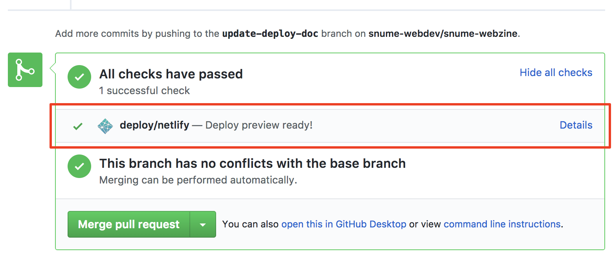

# 설치

1. [nvm](https://github.com/creationix/nvm) 혹은 [nvm-windows](https://github.com/coreybutler/nvm-windows)를 이용해 Node.js v8 버전 설치
1. 터미널에서 `git clone git@github.com:snume-webdev/snume-webzine.git` 실행
1. `snume-webzine` 폴더로 이동 후 `npm install`

# 실행 및 글 작성

- 초안을 작성하려면 터미널에서 `npm run draft` 실행 후, 코드에디터에서 새로운 파일(확장자 md)를 `source/_drafts` 폴더에 생성 후 글을 작성
- 초안이 작성되었으면 해당 파일을 `source/_posts` 폴더로 이동
- 초안을 제외한 웹사이트를 보고 싶으면 `npm run server` 명령 실행

# 배포

GitHub의 `master` 브랜치에 새로운 내용이 추가되면 `https://www.e-mazine.org`에 자동으로 반영됩니다.



GitHub에 pull request를 생성하면 위와 같이 해당 브랜치에 대한 사이트가 뜹니다. 이 사이트를 통해 팀원 간에 실제로 어떤 변경사항이 있었는지 공유하세요.

# 글 작성 시 주의사항

## 마크다운에 정해져있는 문장 요소를 정확히 사용하세요

볼드 표시를 위해서 제목 요소를 사용하는 등, 스타일의 적용만을 위해서 의미에 맞지 않는 문장 요소를 사용하는 것은 좋지 않은데, 추후 스타일 수정이나 플러그인 연동 시 일을 어렵게 만드는 원인이 되기 때문입니다.
마크다운에서 정해놓은 의미에 맞게 문장 요소를 사용하세요. 마크다운에서 지원하지 않는 스타일을 사용하고 싶다면 아래와 같이 직접 HTML 태그를 사용하세요.

```html
<!-- 블록 요소의 경우 -->
<div style="color: red; margin: 5em 0;">빨강색이고 상하마진이 큰 블록 요소</div>

<!-- 인라인 요소의 경우 -->
<span style="color: blue; letter-spacing: -0.1em;">파랑색이고 자간이 좁은 인라인 요소</span>
```

## 다른 곳에서 복사해온 글의 개행 문제

외부 에디터에서 편집한 글을 복사해오면, 눈에는 보이지 않지만 이상한 공백 문자가 섞여서 Hexo 렌더링 결과가 이상해보일 수 있습니다. 그 때에는 문서의 개행(엔터)을 전부 다시 해주어야 합니다.

## 따옴표와 볼드 적용 순서

Hexo의 마크다운 엔진은 여는 따옴표와 닫는 따옴표를 자동으로 인식해 각각을 맞는 모양으로 바꾸어줍니다. 그런데 마크다운의 볼드 문법을 잘못 쓰면 이 기능이 제대로 동작하지 않습니다. 아래를 참고해주세요.

```
**"좋은 예"**

"**나쁜 예**"
```

## 제목은 4단계까지만

```
# 1단계 제목
## 2단계 제목
### 3단계 제목
#### 4단계 제목
```

- 1단계 제목: 글의 제목 혹은 부제를 붙이고 싶을 때 사용. 글 전체에서 하나만 사용하도록 합니다.
- 2단계 제목: 문서의 섹션을 나누는 큰 단위의 제목을 표시하고 싶을 때 사용합니다.
- 3단계 제목: 2단계 제목으로 나누어진 섹션을 더 잘게 나누고 싶을 때, 혹은 2단계 제목을 사용하지 않았지만 문서의 작은 부분에 대한 제목을 붙이고 싶을 때 사용합니다.
- 4단계 제목: 3단계 제목으로 나누어진 섹션을 더 잘게 나누고 싶을 때 사용합니다. 4단계 제목의 폰트 크기는 일반 텍스트의 폰트 크기와 같습니다. 대부분의 경우 2단계, 3단계 제목만을 사용해서 문서를 작성할 수 있습니다.

**5단계 제목부터는 사용하지 않습니다**

## 카테코리 지정 방법

하나의 글에 여러 카테고리를 지정하고 싶을 때는 반드시 각 카테고리 이름을 `[...]`로 [둘러주어야 합니다.](https://hexo.io/docs/front-matter.html#Categories-amp-Tags)
